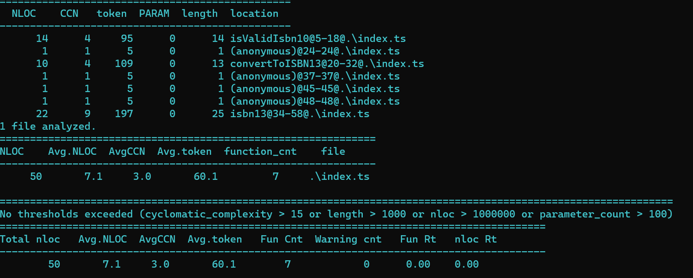

# Section C

The above stats were returned by a program called [Lizard](https://pypi.org/project/lizard/).

## Overal Project Structure

- index.ts
- index.test.ts
- tsconfig.json
- package.json
- package-lock.json
- babel.config.js
- .gitignore
- program-stats.png

## Scripts

- `npm install` - installs all the necessary node modules that are needed in development.
- `npx tsc` - used to bundle all the `.ts` files into `.js` and outputs into a dist folder.
- `npm test` - runs all the created tests in the `index.test.js` file.